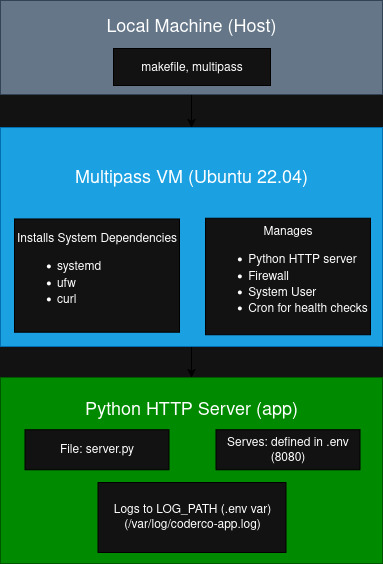
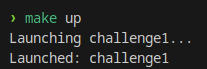
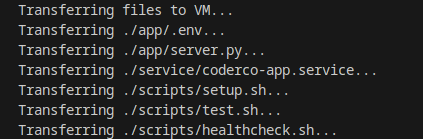
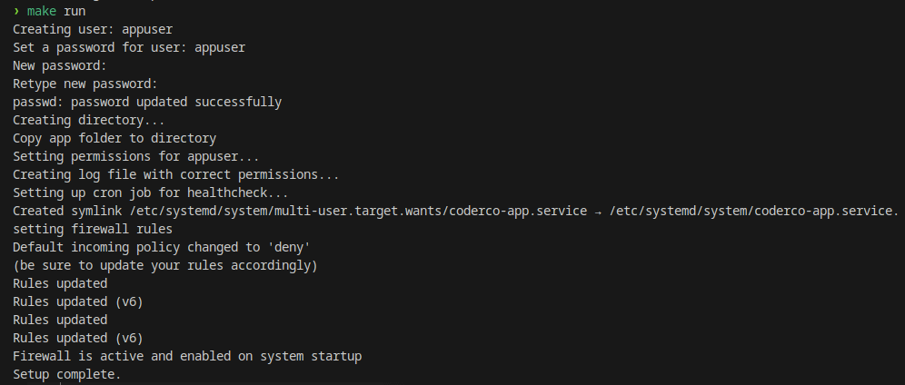
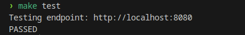
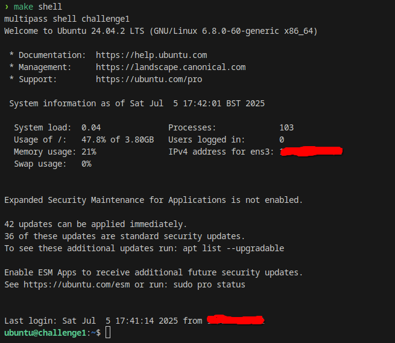

# Challenge 1 

## Overview

This project automates the deployment and health monitoring of a simple Python HTTP server application (`server.py`) running on Ubuntu inside a Multipass VM.

Key features:

- Creates a dedicated system user (`appuser`) to run the app securely.
- Deploys the Python app to `/opt/coderco-app`.
- Uses a systemd service (`coderco-app.service`) to manage the app process.
- Reads environment variables from `.env` for configurable PORT and LOG_PATH.
- Sets up a log file with proper ownership and permissions.
- Applies firewall rules (via `ufw`) to allow access to the app port (default 8080) **only from localhost**.
- Installs and configures a cron job that runs a separate `healthcheck.sh` script every minutes to verify the app endpoint.
- Provides Makefile commands to launch, run, test, and destroy the VM easily.

---

## Project Structure


```sh
challenge1/
├── app/
│   ├── server.py
│   └── .env
├── service/
│   └── coderco-app.service
├── scripts/
│   ├── setup.sh
│   ├── test.sh
│   └── healthcheck.sh
└── Makefile
```


Here's a **"Local Setup"** section you can add to your `README.md`:

---

## Local Setup

Follow these steps to set up and run the project locally using [Multipass](https://multipass.run/):

#### Prerequisites

* [Multipass](https://multipass.run/) installed
* `make` installed on your local machine
* Internet connection (to install packages inside the VM)


**Clone the Repository**

   ```bash
   git clone https://github.com/your-username/your-repo.git
   cd your-repo
   ```
---

## Makefile Commands
| Command      | Description                                                                                 |
|--------------|---------------------------------------------------------------------------------------------|
| `make up`    | Launches the VM if not already running, installs dependencies (systemd, ufw), and transfers necessary files to the VM. |
| `make run`   | Runs the setup script inside the VM to install the app, create user, configure firewall, systemd service, cron, etc.       |
| `make health`| Runs the healthcheck script on the VM to verify the app’s health status.                     |
| `make test`  | Runs the test script on the VM that tests the app’s HTTP endpoint.                          |
| `make shell` | Opens an interactive shell session inside the VM.                                          |
| `make destroy`| Deletes and purges the VM instance.                                                        |


---

## Project Architecture





## Screenshot Demos


1. `make up` – Launches the VM and installs dependencies  
     
   

2. `make run` – Sets up the app inside the VM  
   

3. `make test` – Executes test cases inside the VM  
   

4. `make shell` – Opens an interactive shell to the VM  
   
